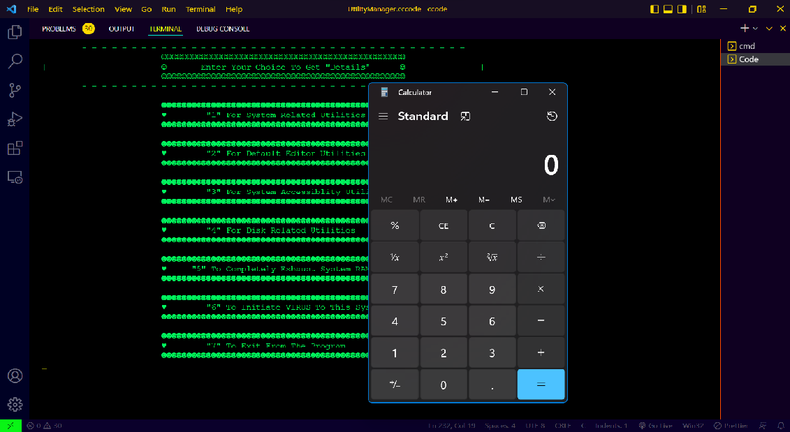
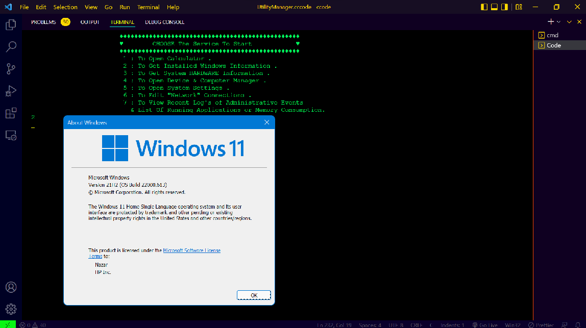
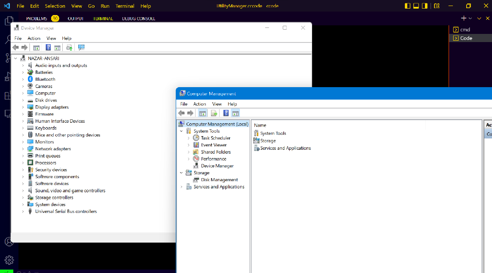
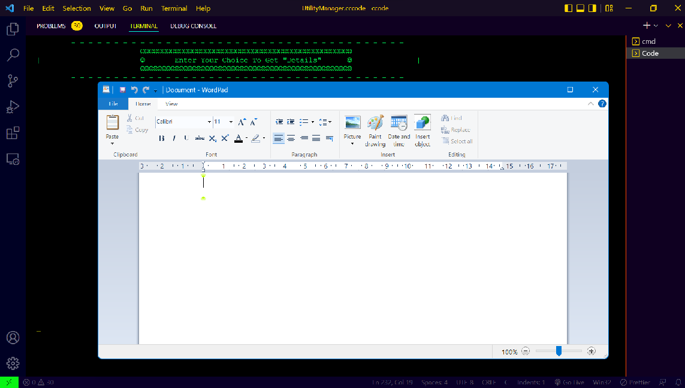
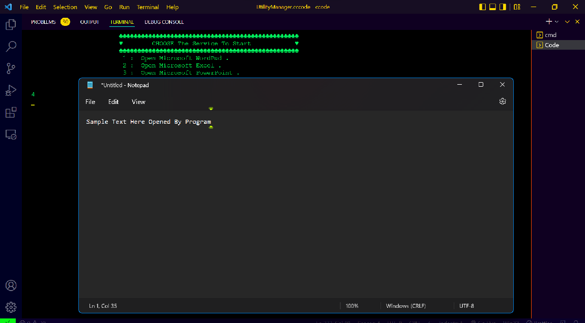
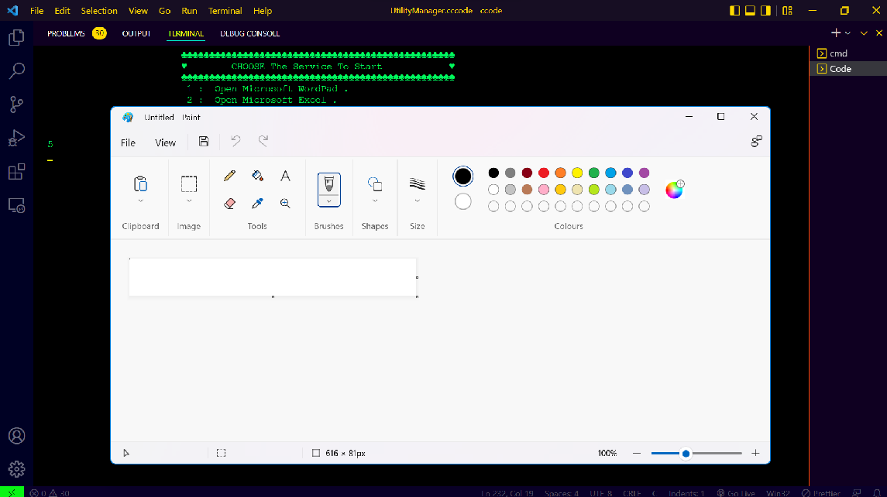
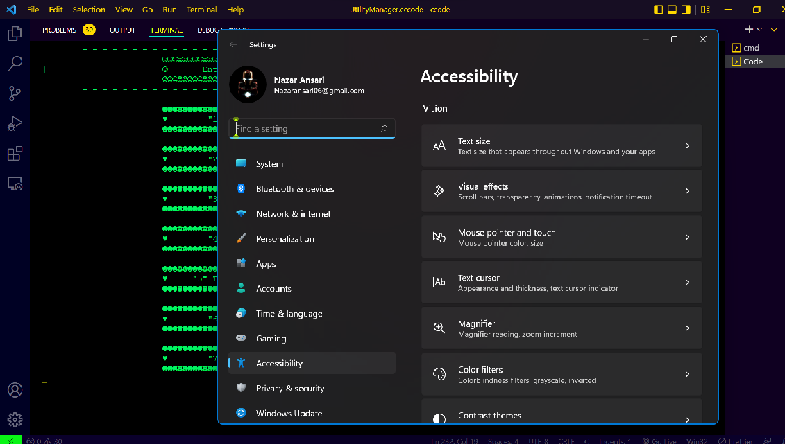
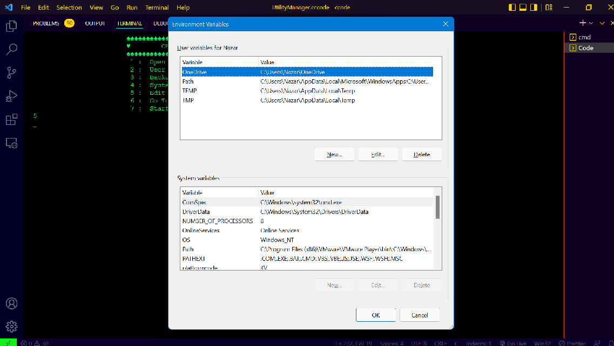
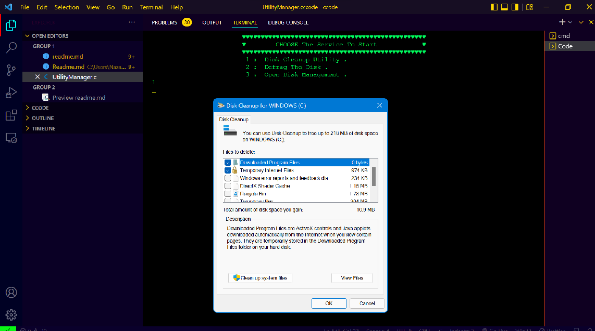
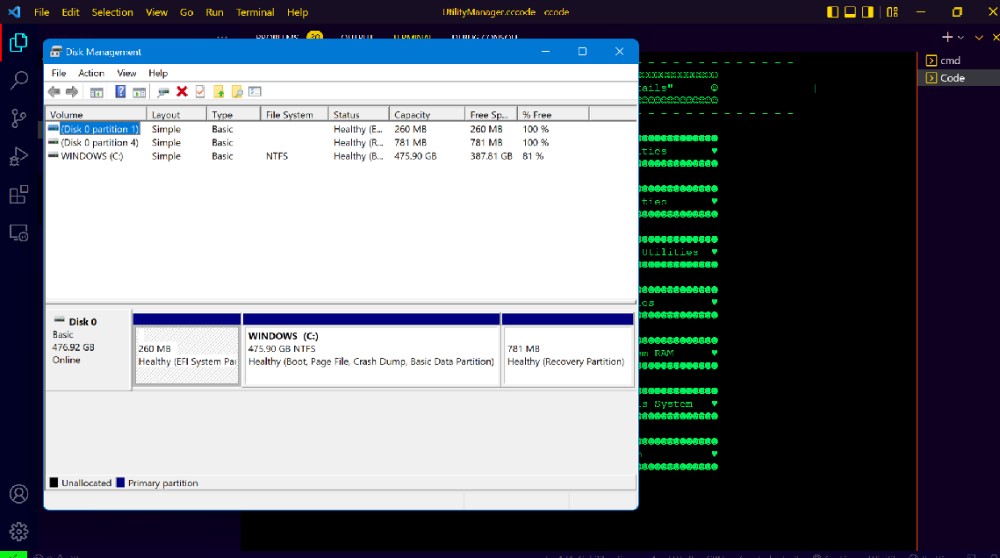

<hr>

# 💥 _Windows Utility Manger_ 💥
<hr>

### _**About This Program:**_
* `This Tool is Made For Essential Purpose of Accessebility .`
* `It's Simply Access Your Inbuilt Windows Application  & Get To you in Better manner .`
*  _**NOTE:**_ `This Program is Not Made For `  _UNIX_ `or` _Linux_ `Platform .`
### _**Process To Execute:**_
```bash
./UtilityManager.exe

        - - - - - - - - - - - - - - - - - - - - - - - - - - - - - - - - - - - - - - -
                        ☺☺☺☺☺☺☺☺☺☺☺☺☺☺☺☺☺☺☺☺☺☺☺☺☺☺☺☺☺☺☺☺☺☺☺☺☺☺☺☺☺☺☺☺☺☺☺☺☺
|                       ☺       Enter Your Choice To Get "Details"      ☺               |
                        ☺☺☺☺☺☺☺☺☺☺☺☺☺☺☺☺☺☺☺☺☺☺☺☺☺☺☺☺☺☺☺☺☺☺☺☺☺☺☺☺☺☺☺☺☺☺☺☺☺
        - - - - - - - - - - - - - - - - - - - - - - - - - - - - - - - - - - - - - - -

                        ☻☻☻☻☻☻☻☻☻☻☻☻☻☻☻☻☻☻☻☻☻☻☻☻☻☻☻☻☻☻☻☻☻☻☻☻☻☻☻☻☻☻☻☻☻☻☻☻☻
                        ♥        "1" For System Related Utilities       ♥
                        ☻☻☻☻☻☻☻☻☻☻☻☻☻☻☻☻☻☻☻☻☻☻☻☻☻☻☻☻☻☻☻☻☻☻☻☻☻☻☻☻☻☻☻☻☻☻☻☻☻

                        ☻☻☻☻☻☻☻☻☻☻☻☻☻☻☻☻☻☻☻☻☻☻☻☻☻☻☻☻☻☻☻☻☻☻☻☻☻☻☻☻☻☻☻☻☻☻☻☻☻
                        ♥        "2" For Default Editor Utilities       ♥
                        ☻☻☻☻☻☻☻☻☻☻☻☻☻☻☻☻☻☻☻☻☻☻☻☻☻☻☻☻☻☻☻☻☻☻☻☻☻☻☻☻☻☻☻☻☻☻☻☻☻

                        ☻☻☻☻☻☻☻☻☻☻☻☻☻☻☻☻☻☻☻☻☻☻☻☻☻☻☻☻☻☻☻☻☻☻☻☻☻☻☻☻☻☻☻☻☻☻☻☻☻
                        ♥        "3" For System Accessiblity Utilities  ♥
                        ☻☻☻☻☻☻☻☻☻☻☻☻☻☻☻☻☻☻☻☻☻☻☻☻☻☻☻☻☻☻☻☻☻☻☻☻☻☻☻☻☻☻☻☻☻☻☻☻☻

                        ☻☻☻☻☻☻☻☻☻☻☻☻☻☻☻☻☻☻☻☻☻☻☻☻☻☻☻☻☻☻☻☻☻☻☻☻☻☻☻☻☻☻☻☻☻☻☻☻☻
                        ♥        "4" For Disk Related Utilities         ♥
                        ☻☻☻☻☻☻☻☻☻☻☻☻☻☻☻☻☻☻☻☻☻☻☻☻☻☻☻☻☻☻☻☻☻☻☻☻☻☻☻☻☻☻☻☻☻☻☻☻☻

                        ☻☻☻☻☻☻☻☻☻☻☻☻☻☻☻☻☻☻☻☻☻☻☻☻☻☻☻☻☻☻☻☻☻☻☻☻☻☻☻☻☻☻☻☻☻☻☻☻☻
                        ♥     "5" To Completely Exhaust System RAM      ♥
                        ☻☻☻☻☻☻☻☻☻☻☻☻☻☻☻☻☻☻☻☻☻☻☻☻☻☻☻☻☻☻☻☻☻☻☻☻☻☻☻☻☻☻☻☻☻☻☻☻☻

                        ☻☻☻☻☻☻☻☻☻☻☻☻☻☻☻☻☻☻☻☻☻☻☻☻☻☻☻☻☻☻☻☻☻☻☻☻☻☻☻☻☻☻☻☻☻☻☻☻☻
                        ♥        "6" To Initiate VIRUS To This System   ♥
                        ☻☻☻☻☻☻☻☻☻☻☻☻☻☻☻☻☻☻☻☻☻☻☻☻☻☻☻☻☻☻☻☻☻☻☻☻☻☻☻☻☻☻☻☻☻☻☻☻☻

                        ☻☻☻☻☻☻☻☻☻☻☻☻☻☻☻☻☻☻☻☻☻☻☻☻☻☻☻☻☻☻☻☻☻☻☻☻☻☻☻☻☻☻☻☻☻☻☻☻☻
                        ♥        "7" To Exit From The Program           ♥
                        ☻☻☻☻☻☻☻☻☻☻☻☻☻☻☻☻☻☻☻☻☻☻☻☻☻☻☻☻☻☻☻☻☻☻☻☻☻☻☻☻☻☻☻☻☻☻☻☻☻
                    
```
_**If User Choose :**_
  <details> <summary> View For 1️⃣</summary>
  
  ```bash
                        ♦♦♦♦♦♦♦♦♦♦♦♦♦♦♦♦♦♦♦♦♦♦♦♦♦♦♦♦♦♦♦♦♦♦♦♦♦♦♦♦♦♦♦♦♦♦♦♦♦
                        ♥        CHOOSE The Service To Start            ♥
                        ♦♦♦♦♦♦♦♦♦♦♦♦♦♦♦♦♦♦♦♦♦♦♦♦♦♦♦♦♦♦♦♦♦♦♦♦♦♦♦♦♦♦♦♦♦♦♦♦♦
                         1 : To Open Calculator .
                         2 : To Get Installed Windows Information .
                         3 : To Get System HARDWARE Information .
                         4 : To Open Device & Computer Manager .
                         5 : To Open System Settings .
                         6 : To Edit "Network" Connections .
                         7 : To View Recent Log's of Administrative Events
                           & List Of Running Applications or Memory Comsumption.
  ```
  - <hr>
  - <hr>
  - <hr><hr>
  </details>
  <br>
  <details > <summary> View For 2️⃣</summary>

  ```bash
                        ♣♣♣♣♣♣♣♣♣♣♣♣♣♣♣♣♣♣♣♣♣♣♣♣♣♣♣♣♣♣♣♣♣♣♣♣♣♣♣♣♣♣♣♣♣♣♣♣♣
                        ♥        CHOOSE The Service To Start            ♥
                        ♣♣♣♣♣♣♣♣♣♣♣♣♣♣♣♣♣♣♣♣♣♣♣♣♣♣♣♣♣♣♣♣♣♣♣♣♣♣♣♣♣♣♣♣♣♣♣♣♣
                         1 :  Open Microsoft WordPad .
                         2 :  Open Microsoft Excel .
                         3 :  Open Microsoft PowerPoint .
                         4 :  Open Notepad In Current Location .
                         5 :  Open Microsoft Paint .
  ```

- <hr>
- <hr>
- <hr><hr>
  </details>
  <br>
  <details><summary> View For 3️⃣</summary>
  
  ```bash
                        ♠♠♠♠♠♠♠♠♠♠♠♠♠♠♠♠♠♠♠♠♠♠♠♠♠♠♠♠♠♠♠♠♠♠♠♠♠♠♠♠♠♠♠♠♠♠♠♠♠
                        ♥        CHOOSE The Service To Start            ♥
                        ♠♠♠♠♠♠♠♠♠♠♠♠♠♠♠♠♠♠♠♠♠♠♠♠♠♠♠♠♠♠♠♠♠♠♠♠♠♠♠♠♠♠♠♠♠♠♠♠♠
                         1 :  Open System Accessiblity Section .
                         2 :  User Account Management .
                         3 :  Backup & Restore Utility .
                         4 :  System Display Color Management .
                         5 :  Edit Environment Variable .
                         6 :  Go To Previous Restore Point .
                         7 :  Start On-Screen Keyboard .
  ```
- <hr>
- <hr><hr>
  </details>
  <br>
  <details><summary> View For 4️⃣</summary>
  
  ```bash
                        ♥♥♥♥♥♥♥♥♥♥♥♥♥♥♥♥♥♥♥♥♥♥♥♥♥♥♥♥♥♥♥♥♥♥♥♥♥♥♥♥♥♥♥♥♥♥♥♥♥
                        ♥        CHOOSE The Service To Start            ♥
                        ♥♥♥♥♥♥♥♥♥♥♥♥♥♥♥♥♥♥♥♥♥♥♥♥♥♥♥♥♥♥♥♥♥♥♥♥♥♥♥♥♥♥♥♥♥♥♥♥♥
                         1 :  Disk Cleanup Utility .
                         2 :  Defrag The Disk .
                         3 :  Open Disk Management .

  ```
- <hr>
- <hr><hr>
  </details>
  <br>
  
`Make Sure While Choosing 5️⃣ This Will Try To Consume Your Whole System RAM.` <br>
`This Will Simply Run UserEnd Application For Multiple Times` **.**

```bash
                        ☻☻☻☻☻☻☻☻☻☻☻☻☻☻☻☻☻☻☻☻☻☻☻☻☻☻☻☻☻☻☻☻☻☻☻☻☻☻☻☻☻☻☻☻☻☻☻☻☻
                        ♥     "5" To Completely Exhaust System RAM      ♥
                        ☻☻☻☻☻☻☻☻☻☻☻☻☻☻☻☻☻☻☻☻☻☻☻☻☻☻☻☻☻☻☻☻☻☻☻☻☻☻☻☻☻☻☻☻☻☻☻☻☻
```
☢️ **_Caution_** ☢️ : ` 6️⃣ Will Initiate a Worm Virus To behave System ABNORMALLY ` **.**
<hr>

#### 👨‍💻Feel Free To Contirbute To This Project👨‍💻

**Copyright :copyright: :** [nazar-ansari](./LICENSE)
